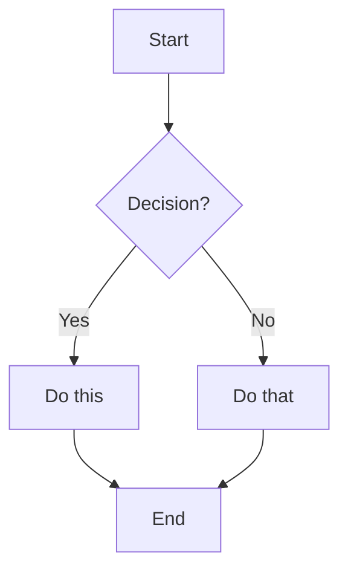
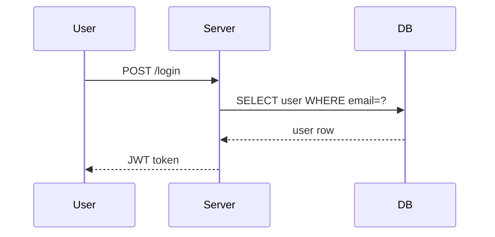
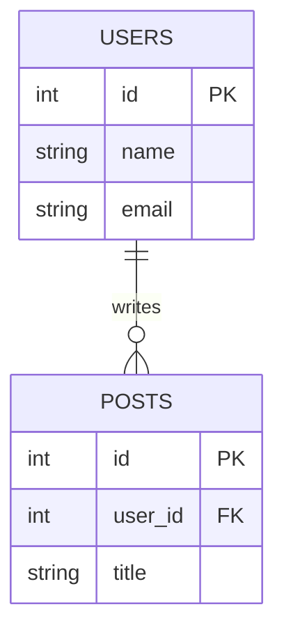
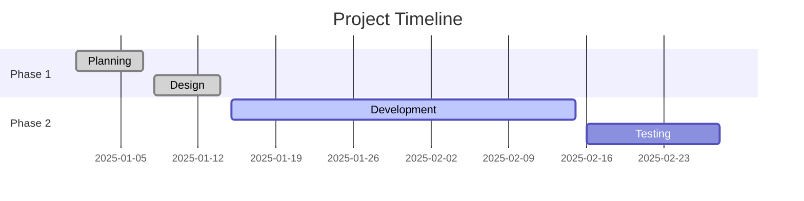
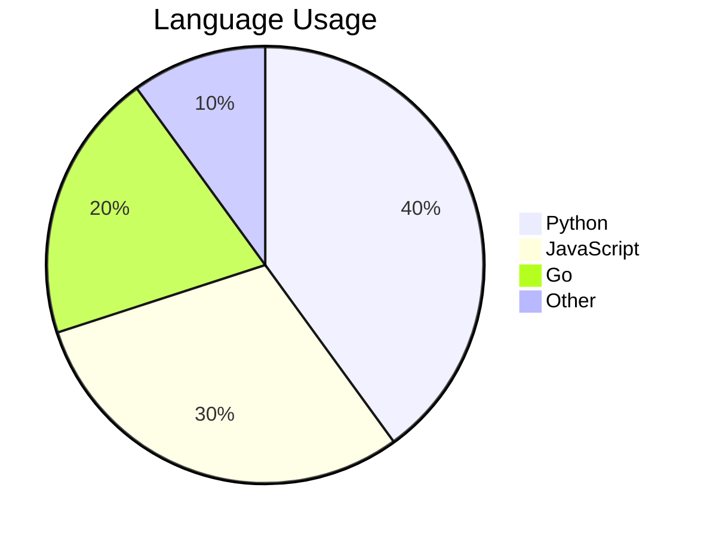

## Introduction

**Markdown** is a lightweight markup language created by **John Gruber** in **2004** with the goal of making it easy to write formatted text using a plain text editor. Markdown converts simple symbols like `#`, `*`, and `>` into HTML — making it readable as plain text AND rendered beautifully. It is used everywhere: **GitHub**, **README files**, **documentation**, **blogs**, **notes**, **Jupyter Notebooks**, **Discord**, **Slack**, and **many more platforms**. Different platforms support different flavors — the most common is **CommonMark** (standard), **GitHub Flavored Markdown (GFM)**, and **Extended Markdown**.

## Headings

**Definition:** Headings create section titles — use `#` symbols, one per level, up to six levels deep.

### Atx-Style Headings (Recommended)
**Definition:** Use `#` symbols followed by a space — the most common and portable heading syntax.
```markdown
# Heading 1 — Page title (largest)
## Heading 2 — Section title
### Heading 3 — Subsection
#### Heading 4 — Sub-subsection
##### Heading 5 — Minor heading
###### Heading 6 — Smallest heading
```

**Renders as:**
# Heading 1
## Heading 2
### Heading 3
#### Heading 4
##### Heading 5
###### Heading 6

### Setext-Style Headings (Alternative)
**Definition:** Underline text with `=` for H1 or `-` for H2 — only works for the first two levels.
```markdown
This is Heading 1
=================

This is Heading 2
-----------------
```

### Heading Rules
**Definition:** Guidelines for using headings correctly and accessibly.
```markdown
# Only one H1 per document — the main title

## H2 for major sections
### H3 for subsections within H2
#### H4 for sub-subsections

<!-- Rules: -->
<!-- 1. Always put a space after # -->
<!-- 2. Don't skip levels (e.g. H1 → H3) -->
<!-- 3. Use only one H1 per page -->
<!-- 4. Leave a blank line before and after headings -->
```

---

## Paragraphs & Line Breaks

**Definition:** Control how text flows — paragraphs need blank lines, line breaks need trailing spaces.

### Paragraphs
**Definition:** A blank line between text blocks creates a new paragraph.
```markdown
This is the first paragraph. It can span
multiple lines — they join into one paragraph.

This is the second paragraph. A blank line
above separates it from the first.

Third paragraph here.
```

**Renders as:**

This is the first paragraph. It can span multiple lines — they join into one paragraph.

This is the second paragraph. A blank line above separates it from the first.

### Line Break
**Definition:** End a line with two or more spaces then press Enter — creates a `<br>` without a new paragraph.
```markdown
First line  
Second line (two spaces after "First line" above)

Or use a backslash:
First line\
Second line
```

### Non-Breaking Space
**Definition:** Prevent a line break between two words using the HTML entity.
```markdown
John&nbsp;Doe        <!-- Stays together on one line -->
100&nbsp;km/h
```

---

## Text Formatting

**Definition:** Apply bold, italic, strikethrough, and other inline formatting to text.

### Bold
**Definition:** Make text bold using double asterisks or double underscores.
```markdown
**This text is bold**
__This text is also bold__

**Bold words** in a sentence.
```

**Renders as:** **This text is bold**

### Italic
**Definition:** Make text italic using single asterisks or single underscores.
```markdown
*This text is italic*
_This text is also italic_

A *single word* in italic.
```

**Renders as:** *This text is italic*

### Bold & Italic Combined
**Definition:** Use triple asterisks or a mix to apply both styles simultaneously.
```markdown
***Bold and italic***
___Bold and italic___
**_Bold outer, italic inner_**
*__Italic outer, bold inner__*
```

**Renders as:** ***Bold and italic***

### Strikethrough
**Definition:** Draw a line through text to show deletion or correction — uses double tildes.
```markdown
~~This text is crossed out~~
The price was ~~$100~~ now $75.
```

**Renders as:** ~~This text is crossed out~~

### Underline
**Definition:** Markdown has no native underline — use HTML `<u>` tag instead.
```markdown
<u>Underlined text</u>
```

**Renders as:** <u>Underlined text</u>

### Inline Code
**Definition:** Highlight code or technical terms inline using backticks.
```markdown
Use the `print()` function in Python.
The variable is `userName`.
Press `Ctrl + C` to copy.
To include a backtick inside code: `` `use double backticks` ``
```

**Renders as:** Use the `print()` function in Python.

---

## Blockquotes

**Definition:** Indent text to show it is a quotation or highlighted note — uses `>` prefix.

### Basic Blockquote
**Definition:** Start lines with `>` to create a blockquote — used for quotes and callouts.
```markdown
> This is a blockquote.
> It can span multiple lines.
> Each line starts with >.
```

> This is a blockquote. It can span multiple lines.

### Nested Blockquote
**Definition:** Double `>>` creates a blockquote inside a blockquote.
```markdown
> Outer blockquote level one.
>
>> Nested blockquote level two.
>>
>>> Triple-nested level three.
```

> Outer blockquote level one.
>
>> Nested blockquote level two.

### Blockquote with Formatting
**Definition:** You can use other Markdown inside a blockquote.
```markdown
> **Important:** This is a critical note.
>
> - Bullet point inside quote
> - Another bullet
>
> Use `code` inside quotes too.
```

### Callout Blocks (GitHub, Obsidian)
**Definition:** Some platforms support special callout types with icons.
```markdown
> [!NOTE]
> This is a note callout.

> [!TIP]
> This is a helpful tip.

> [!WARNING]
> This is a warning.

> [!IMPORTANT]
> This is important information.

> [!CAUTION]
> This requires caution.
```

---

## Code

**Definition:** Display code with preserved formatting and optional syntax highlighting.

### Inline Code
**Definition:** Wrap code in single backticks for inline use within a sentence.
```markdown
The `useState` hook returns an array.
Run `npm install` to install dependencies.
```

### Fenced Code Block
**Definition:** Wrap code in triple backticks — add language name for syntax highlighting.
````markdown
```javascript
function greet(name) {
    return `Hello, ${name}!`;
}
```
````

### Code Block with Language
**Definition:** Specify the language after the opening backticks for proper syntax highlighting.
````markdown
```python
def factorial(n):
    if n == 0:
        return 1
    return n * factorial(n - 1)
```

```bash
#!/bin/bash
echo "Hello, World!"
ls -la
```

```sql
SELECT name, age
FROM users
WHERE age > 18
ORDER BY name;
```

```json
{
  "name": "Dark",
  "age": 25,
  "active": true
}
```

```css
.container {
  display: flex;
  align-items: center;
  background-color: #f0f0f0;
}
```
````

### Common Language Tags
**Definition:** Language identifiers for syntax highlighting in code blocks.

| Language | Tag |
|----------|-----|
| Python | `python` |
| JavaScript | `javascript` or `js` |
| TypeScript | `typescript` or `ts` |
| HTML | `html` |
| CSS | `css` |
| Java | `java` |
| Go | `go` |
| Rust | `rust` |
| C / C++ | `c` / `cpp` |
| Shell/Bash | `bash` or `sh` |
| PowerShell | `powershell` |
| SQL | `sql` |
| JSON | `json` |
| YAML | `yaml` |
| XML | `xml` |
| Markdown | `markdown` |
| Dockerfile | `dockerfile` |

### Indented Code Block
**Definition:** Indent 4 spaces or 1 tab to create a code block — older syntax, avoid.
```markdown
    This is a code block
    indented with 4 spaces
    (older syntax — use fenced blocks instead)
```

---

## Links

**Definition:** Create clickable hyperlinks to external URLs, pages, or sections.

### Inline Link
**Definition:** Most common link format — text in brackets, URL in parentheses.
```markdown
[Link Text](https://example.com)
[Visit Google](https://google.com)
[Go to GitHub](https://github.com "GitHub — optional tooltip")
```

**Renders as:** [Visit Google](https://google.com)

### Bare URL (Auto-link)
**Definition:** Wrap a URL in angle brackets — renders as a clickable link.
```markdown
<https://www.example.com>
<user@example.com>
```

**Renders as:** <https://www.example.com>

### Reference-Style Link
**Definition:** Separate the URL from the text — good for long URLs or reusing the same link multiple times.
```markdown
[Link Text][reference-id]
[Another link][1]
[Google][google]

<!-- Definitions anywhere in document (usually at bottom) -->
[reference-id]: https://example.com
[1]: https://example.com/page "Optional title"
[google]: https://google.com
```

### Relative Links
**Definition:** Link to other files in the same project — useful in documentation.
```markdown
[README](README.md)
[Installation Guide](docs/install.md)
[Contributing](../CONTRIBUTING.md)
[See Section Below](#section-name)
```

### Link to Section (Anchor)
**Definition:** Jump to a heading on the same page — heading text becomes the anchor ID.
```markdown
[Jump to Installation](#installation)
[Go to Top](#top)

<!-- Rules for anchor IDs: -->
<!-- 1. Convert heading to lowercase -->
<!-- 2. Replace spaces with hyphens - -->
<!-- 3. Remove special characters -->
<!-- Example: "My Cool Section!" → #my-cool-section -->
```

---

## Images

**Definition:** Embed images inline — similar to links but with a `!` prefix.

### Basic Image
**Definition:** Alt text in brackets, image path or URL in parentheses.
```markdown


```

### Image with Link
**Definition:** Wrap an image in a link — click the image to navigate.
```markdown
[](https://example.com)
[](https://github.com)
```

### Reference-Style Image
**Definition:** Separate the URL from the image declaration — same as reference links.
```markdown
![Logo][logo-ref]
![Banner][banner]

[logo-ref]: https://example.com/logo.png
[banner]: images/banner.jpg "Site Banner"
```

### Image Size (HTML)
**Definition:** Markdown has no native image sizing — use HTML for width/height control.
```markdown


```

### Center Image (HTML)
**Definition:** Center an image using HTML tags.
```markdown
<p align="center">
  
</p>
```

---

## Unordered Lists

**Definition:** Bullet-point lists for items where order doesn't matter.

### Basic Unordered List
**Definition:** Use `-`, `*`, or `+` before items — pick one and stay consistent.
```markdown
- Item one
- Item two
- Item three

* Also works with asterisks
* Second item
* Third item

+ Plus signs work too
+ Second item
```

**Renders as:**
- Item one
- Item two
- Item three

### List with Paragraphs
**Definition:** Add a blank line between items to give each its own paragraph block.
```markdown
- First item

  This paragraph belongs to the first item.
  Indent with 2 spaces.

- Second item

  Another paragraph here.

- Third item
```

---

## Ordered Lists

**Definition:** Numbered lists for items where sequence or priority matters.

### Basic Ordered List
**Definition:** Use numbers followed by periods — the actual numbers don't matter, rendering resets to 1.
```markdown
1. First item
2. Second item
3. Third item

<!-- Numbers don't have to be sequential -->
1. First
1. Second (still renders as 2)
1. Third  (still renders as 3)

<!-- Starting at a different number -->
5. Item five
6. Item six
7. Item seven
```

**Renders as:**
1. First item
2. Second item
3. Third item

---

## Nested Lists

**Definition:** Create multi-level lists by indenting child items with spaces.

### Nested Unordered
**Definition:** Indent 2–4 spaces to create a sub-list inside a list item.
```markdown
- Fruits
  - Apple
  - Banana
  - Cherry
    - Bing cherry
    - Sweet cherry
- Vegetables
  - Carrot
  - Peas
```

**Renders as:**
- Fruits
  - Apple
  - Banana
- Vegetables
  - Carrot

### Mixed Nested Lists
**Definition:** Mix ordered and unordered lists at different levels.
```markdown
1. First step
   - Do this
   - Then this
2. Second step
   - Option A
   - Option B
     1. Sub-step one
     2. Sub-step two
3. Third step
```

---

## Task Lists

**Definition:** Interactive checkboxes — supported on GitHub, GitLab, Obsidian, and many others.

### Basic Task List
**Definition:** Use `- [ ]` for unchecked and `- [x]` for checked items.
```markdown
- [x] Buy groceries
- [x] Write README
- [ ] Deploy to production
- [ ] Write unit tests
- [ ] Update documentation
```

**Renders as:**
- [x] Buy groceries
- [x] Write README
- [ ] Deploy to production
- [ ] Write unit tests

### Nested Task List
**Definition:** Nest tasks to show subtasks under a parent task.
```markdown
- [x] Plan project
  - [x] Define requirements
  - [x] Create wireframes
  - [ ] Get approval
- [ ] Development
  - [x] Set up repo
  - [ ] Build backend API
  - [ ] Build frontend
- [ ] Testing
  - [ ] Unit tests
  - [ ] Integration tests
```

---

## Horizontal Rules

**Definition:** A horizontal line that visually divides sections of content.

### Create Horizontal Rule
**Definition:** Use three or more dashes, asterisks, or underscores on their own line.
```markdown
---

***

___

- - -

* * *
```

**All render as:**

---

### Usage Tips
**Definition:** Use sparingly to separate major sections — headings are usually better for structure.
```markdown
## Section One

Content for section one...

---

## Section Two

Content for section two...
```

---

## Tables

**Definition:** Create data tables using pipes `|` and dashes `-` — supported in GFM and most platforms.

### Basic Table
**Definition:** Use `|` to separate columns and `---` to separate the header row from data rows.
```markdown
| Name    | Age | City    |
|---------|-----|---------|
| Dark    | 25  | Mumbai  |
| Alice   | 30  | Delhi   |
| Bob     | 28  | Chennai |
```

**Renders as:**

| Name    | Age | City    |
|---------|-----|---------|
| Dark    | 25  | Mumbai  |
| Alice   | 30  | Delhi   |
| Bob     | 28  | Chennai |

### Column Alignment
**Definition:** Control text alignment in columns using colons in the separator row.
```markdown
| Left-aligned | Center-aligned | Right-aligned |
|:-------------|:--------------:|--------------:|
| Text         |     Text       |          Text |
| More text    |   More text    |     More text |
| 1            |       2        |             3 |
```

**Renders as:**

| Left-aligned | Center-aligned | Right-aligned |
|:-------------|:--------------:|--------------:|
| Text         |     Text       |          Text |
| 1            |       2        |             3 |

### Table with Formatting
**Definition:** Use inline formatting inside table cells.
```markdown
| Feature      | Status  | Notes                    |
|--------------|---------|--------------------------|
| Login        | ✅ Done  | Fully tested             |
| Dashboard    | 🔄 WIP  | **In progress**          |
| Reports      | ❌ Todo  | ~Blocked~ by API issue   |
| Export       | ✅ Done  | `v2.1` and above         |
```

### Table Tips
**Definition:** Pipes don't need to be aligned — they just need to be present.
```markdown
| Minimal table |
|---|
| cell |

<!-- Outer pipes optional in some parsers -->
Name | Age
-----|----
Dark | 25
```

---

## Footnotes

**Definition:** Add references or explanatory notes at the bottom — supported in GFM and extended Markdown.

### Create Footnotes
**Definition:** Use `[^label]` inline and define it anywhere in the document.
```markdown
Here is some text with a footnote.[^1]
Another reference.[^note]

[^1]: This is the first footnote content.
[^note]: This is a longer footnote.
    It can span multiple lines if indented.
```

**Renders as:**

Here is some text with a footnote.[^1]

[^1]: This is the first footnote content.

---

## HTML in Markdown

**Definition:** Raw HTML works inside Markdown — use it for features Markdown doesn't support natively.

### Common HTML Uses
**Definition:** Embed HTML when Markdown syntax is not enough.
```markdown
<!-- Comments (hidden from output) -->

<!-- Center content -->
<div align="center">
  <h1>Centered Heading</h1>
  <p>Centered paragraph</p>
</div>

<!-- Colored text -->
<span style="color: red;">Red text</span>
<span style="color: #0066cc;">Blue text</span>

<!-- Underline -->
<u>Underlined text</u>

<!-- Superscript and subscript -->
H<sub>2</sub>O
E = mc<sup>2</sup>

<!-- Line break -->
Line one<br>Line two

<!-- Keyboard key -->
Press <kbd>Ctrl</kbd> + <kbd>C</kbd> to copy.

<!-- Small text -->
<small>Small print text here</small>

<!-- Details / summary (collapsible) -->
<details>
  <summary>Click to expand</summary>
  Hidden content shown on click.
</details>
```

**Renders as:**

Press <kbd>Ctrl</kbd> + <kbd>C</kbd> to copy.

---

## Escaping Characters

**Definition:** Use a backslash `\` to display characters that Markdown would normally interpret as formatting.

### Escape with Backslash
**Definition:** Put `\` before any special character to display it literally.
```markdown
\*This is not italic\*
\**This is not bold\**
\# This is not a heading
\- This is not a list item
\> This is not a blockquote
\[This is not a link\]
\`This is not code\`
\\ A literal backslash

<!-- Characters that need escaping: -->
\ ` * _ { } [ ] ( ) # + - . ! |
```

**Renders as:** \*This is not italic\*

### HTML Entities
**Definition:** Use HTML entities for special characters — always works regardless of parser.
```markdown
&lt;    →  <  (less than)
&gt;    →  >  (greater than)
&amp;   →  &  (ampersand)
&quot;  →  "  (double quote)
&apos;  →  '  (apostrophe)
&copy;  →  ©  (copyright)
&reg;   →  ®  (registered trademark)
&trade; →  ™  (trademark)
&mdash; →  —  (em dash)
&ndash; →  –  (en dash)
&nbsp;  →     (non-breaking space)
&hellip; → …  (ellipsis)
```

---

## Emoji

**Definition:** Insert emoji using shortcodes or directly by pasting the emoji character.

### Emoji Shortcodes
**Definition:** Use `:emoji-name:` syntax — supported on GitHub, Slack, Discord, and others.
```markdown
:smile:       😄
:heart:       ❤️
:thumbsup:    👍
:rocket:      🚀
:star:        ⭐
:fire:        🔥
:warning:     ⚠️
:white_check_mark: ✅
:x:           ❌
:bulb:        💡
:pencil:      ✏️
:book:        📚
:computer:    💻
:tada:        🎉
:zap:         ⚡
:eyes:        👀
:pray:        🙏
:muscle:      💪
:100:         💯
:new:         🆕
:construction: 🚧
:lock:        🔒
:key:         🔑
:hammer:      🔨
:bug:         🐛
:memo:        📝
:chart_with_upwards_trend: 📈
```

### Direct Emoji
**Definition:** Paste emoji directly — works everywhere that renders Markdown.
```markdown
I love coding 💻 and coffee ☕

Project status: ✅ Done | 🔄 In Progress | ❌ Blocked

Languages: 🐍 Python | ☕ Java | 🦀 Rust | 🐹 Go
```

---

## Comments

**Definition:** Add hidden notes in Markdown — not visible in the rendered output.

### HTML Comment Syntax
**Definition:** Use HTML comment syntax — the only standard way to add comments in Markdown.
```markdown
<!-- This comment is hidden from readers -->

<!-- TODO: Add more examples here -->

<!-- 
  Multi-line comment
  Spans several lines
  All hidden from output
-->

Regular text here.  <!-- Inline comment at end of line -->
```

---

## Definition Lists

**Definition:** Term-and-definition pairs — supported in extended Markdown (Pandoc, kramdown, PHP Markdown Extra).

### Basic Definition List
**Definition:** Write term on one line, then `: ` followed by definition on the next.
```markdown
HTML
:   HyperText Markup Language — used to structure web pages.

CSS
:   Cascading Style Sheets — used to style web pages.

JavaScript
:   A programming language for adding interactivity.
    Can span multiple lines if indented.

Term with multiple definitions
:   First definition.
:   Second definition.
```

---

## Abbreviations

**Definition:** Define abbreviations that render as tooltips on hover — supported in kramdown and PHP Markdown Extra.

### Abbreviation Syntax
**Definition:** Define the abbreviation anywhere in the document — all occurrences get a tooltip.
```markdown
The HTML specification is maintained by W3C.
CSS stands for Cascading Style Sheets.
I write in Markdown every day.

*[HTML]: HyperText Markup Language
*[W3C]: World Wide Web Consortium
*[CSS]: Cascading Style Sheets
*[Markdown]: A lightweight markup language
```

---

## Superscript & Subscript

**Definition:** Raise or lower text — supported in some Markdown flavors and via HTML.

### Superscript
**Definition:** Raised text — used for footnote numbers, mathematical powers, ordinal suffixes.
```markdown
<!-- HTML (universal) -->
E = mc<sup>2</sup>
10<sup>th</sup> floor
x<sup>2</sup> + y<sup>2</sup> = r<sup>2</sup>

<!-- Pandoc/some parsers -->
E = mc^2^
x^2^
```

### Subscript
**Definition:** Lowered text — used for chemical formulas and mathematical notation.
```markdown
<!-- HTML (universal) -->
H<sub>2</sub>O
CO<sub>2</sub>
x<sub>i</sub> + y<sub>j</sub>

<!-- Pandoc/some parsers -->
H~2~O
CO~2~
```

---

## Highlight

**Definition:** Mark text with a yellow highlight — supported in some extended Markdown parsers.

### Highlight Syntax
**Definition:** Use double equals signs to highlight — supported in Obsidian, Pandoc, and some others.
```markdown
<!-- Extended Markdown (Obsidian, Pandoc) -->
This is ==highlighted text== in a sentence.

<!-- HTML alternative (universal) -->
This is <mark>highlighted text</mark> anywhere.
```

**Renders as:** This is <mark>highlighted text</mark> anywhere.

---

## Math (LaTeX)

**Definition:** Render mathematical notation using LaTeX syntax — supported in Jupyter, GitHub, Obsidian, and others.

### Inline Math
**Definition:** Wrap LaTeX between single dollar signs for inline equations.
```markdown
The quadratic formula is $x = \frac{-b \pm \sqrt{b^2 - 4ac}}{2a}$.

Einstein's equation: $E = mc^2$

Euler's identity: $e^{i\pi} + 1 = 0$
```

### Block Math
**Definition:** Double dollar signs create a centered equation block on its own line.
```markdown
$$
\int_{a}^{b} f(x)\,dx = F(b) - F(a)
$$

$$
\sum_{n=1}^{\infty} \frac{1}{n^2} = \frac{\pi^2}{6}
$$

$$
\begin{pmatrix}
a & b \\
c & d
\end{pmatrix}
$$
```

### Common LaTeX Symbols
**Definition:** Frequently used LaTeX math symbols.
```latex
% Greek letters
\alpha  \beta  \gamma  \delta  \pi  \sigma  \theta  \omega

% Operations
\times  \div  \pm  \neq  \leq  \geq  \approx  \infty

% Fractions & roots
\frac{a}{b}    \sqrt{x}    \sqrt[n]{x}

% Summation & integration
\sum_{i=1}^{n}    \int_{a}^{b}    \prod_{i=1}^{n}

% Limits
\lim_{x \to \infty}    \lim_{n \to 0}

% Vectors & matrices
\vec{v}    \hat{u}    \begin{matrix} ... \end{matrix}
```

---

## Diagrams (Mermaid)

**Definition:** Create diagrams using text syntax — supported on GitHub, GitLab, Obsidian, and many tools.

### Flowchart
**Definition:** Show process flow with nodes and arrows.
````markdown

````

### Sequence Diagram
**Definition:** Show interactions between actors over time.
````markdown

````

### Entity Relationship Diagram
**Definition:** Show database tables and their relationships.
````markdown

````

### Gantt Chart
**Definition:** Show project timeline and task scheduling.
````markdown

````

### Pie Chart
**Definition:** Show proportional data as a pie chart.
````markdown

````

---

## Collapsible Sections

**Definition:** Create expandable/collapsible content blocks using HTML `<details>` and `<summary>` tags.

### Basic Collapsible
**Definition:** Hide content behind a clickable toggle — works on GitHub and most HTML renderers.
```markdown
<details>
  <summary>Click to expand</summary>

  Hidden content appears here when expanded.

  - Can include lists
  - And other Markdown

</details>
```

**Renders as:**

<details>
  <summary>Click to expand</summary>

  Hidden content appears here when expanded.

</details>

### Collapsible with Code
**Definition:** Hide long code blocks or examples to keep documents clean.
```markdown
<details>
  <summary>Show example code</summary>

```python
def hello(name):
    return f"Hello, {name}!"

print(hello("World"))
```

</details>
```

### Open by Default
**Definition:** Add the `open` attribute to have the section expanded when the page loads.
```markdown
<details open>
  <summary>This is open by default</summary>

  Content visible immediately.

</details>
```

---

## Badges & Shields

**Definition:** Visual status indicators — commonly used in README files to show build status, version, license.

### Shield.io Badges
**Definition:** Generate badges from shields.io using URL patterns.
```markdown
<!-- Syntax -->


<!-- Examples -->


```

### Common Badge Colors
**Definition:** Standard colors and their typical meaning.

| Color | Name | Use |
|-------|------|-----|
| `brightgreen` | 🟢 | Passing, success |
| `green` | 🟢 | Good, stable |
| `yellow` | 🟡 | Warning, pending |
| `orange` | 🟠 | Caution |
| `red` | 🔴 | Failing, error |
| `blue` | 🔵 | Info, version |
| `lightgrey` | ⚪ | Neutral |

### GitHub-Specific Badges
**Definition:** Badges that automatically pull data from your GitHub repository.
```markdown


```

---

## GitHub Flavored Markdown

**Definition:** GitHub's extended version of Markdown with additional features specific to GitHub.

### Mentions & References
**Definition:** Link to people, issues, pull requests, and commits using `@` and `#`.
```markdown
<!-- Mention a user -->
@username — notifies and links to the user

<!-- Reference an issue or PR -->
#42         — links to issue or PR #42
user/repo#42 — links to issue in another repo

<!-- Reference a commit -->
abc1234    — links to that commit hash

<!-- Close an issue with a commit message -->
Fixes #42
Closes #42
Resolves #42
```

### Auto-linked URLs
**Definition:** GitHub automatically links bare URLs without needing angle brackets.
```markdown
https://github.com    ← Auto-linked on GitHub
```

### SHA & Commit References
**Definition:** GitHub automatically links commit hashes and branch/tag names.
```markdown
16c999e8c71134401a78d4d46435517b2271d6ac    ← Full SHA
16c999e                                      ← Short SHA (7+ chars)
```

### Alerts / Callouts (GitHub)
**Definition:** Specially styled callout blocks — rendered with icons and colors on GitHub.
```markdown
> [!NOTE]
> Useful information that users should know.

> [!TIP]
> Helpful advice for doing things better.

> [!IMPORTANT]
> Key information users need to know.

> [!WARNING]
> Urgent info needing immediate attention.

> [!CAUTION]
> Advises about risks or negative outcomes.
```

### Keyboard Shortcuts in Markdown (GitHub)
**Definition:** GitHub supports `<kbd>` for keyboard shortcut display.
```markdown
Press <kbd>Ctrl</kbd> + <kbd>S</kbd> to save.
Use <kbd>Cmd</kbd> + <kbd>Shift</kbd> + <kbd>P</kbd> to open palette.
```

---

## Front Matter (YAML)

**Definition:** Metadata at the top of a Markdown file — used by static site generators, Jekyll, Hugo, Gatsby, and others.

### YAML Front Matter
**Definition:** Wrap YAML key-value pairs between triple dashes at the very top of the file.
```markdown
---
title: My Blog Post
date: 2025-01-15
author: Dark Kumar
tags:
  - markdown
  - writing
  - tutorial
categories:
  - Web Development
draft: false
description: A complete guide to Markdown.
image: /images/markdown-hero.jpg
permalink: /blog/markdown-guide/
---

# My Blog Post

Content starts here after the front matter block.
```

### Common Front Matter Fields
**Definition:** Frequently used metadata fields across different platforms.
```yaml
---
# Common fields
title: "Page Title"
description: "Short description for SEO"
date: 2025-01-15
lastmod: 2025-06-01
author: "Dark Kumar"
draft: false

# Taxonomy
tags: ["markdown", "writing"]
categories: ["tutorials"]

# URL / navigation
slug: "custom-url-slug"
weight: 10              # Sort order in menus

# Display
image: "/images/cover.jpg"
toc: true               # Table of contents
comments: true          # Enable comments
featured: true
---
```

---

## Markdown in Different Platforms

**Definition:** Each platform has different Markdown support — know what your target supports.

### Feature Comparison
**Definition:** Which features are supported on common platforms.

| Feature | CommonMark | GFM (GitHub) | Obsidian | Pandoc |
|---------|:----------:|:------------:|:--------:|:------:|
| Headings | ✅ | ✅ | ✅ | ✅ |
| Bold/Italic | ✅ | ✅ | ✅ | ✅ |
| Code blocks | ✅ | ✅ | ✅ | ✅ |
| Tables | ❌ | ✅ | ✅ | ✅ |
| Task lists | ❌ | ✅ | ✅ | ✅ |
| Strikethrough | ❌ | ✅ | ✅ | ✅ |
| Footnotes | ❌ | ✅ | ✅ | ✅ |
| Math (LaTeX) | ❌ | ✅ | ✅ | ✅ |
| Mermaid diagrams | ❌ | ✅ | ✅ | ❌ |
| Callouts/Alerts | ❌ | ✅ | ✅ | ❌ |
| Definition lists | ❌ | ❌ | ❌ | ✅ |
| Highlight ==text== | ❌ | ❌ | ✅ | ✅ |

### Platform-Specific Notes
**Definition:** Key differences to be aware of per platform.
```
GitHub (GFM):
  ✅ Tables, task lists, strikethrough, emoji shortcodes
  ✅ Alerts: > [!NOTE], > [!WARNING], etc.
  ✅ Mermaid diagrams in code blocks
  ❌ Definition lists, abbreviations

Obsidian:
  ✅ Callouts: > [!note], > [!tip], etc.
  ✅ Internal links: [[Page Name]]
  ✅ Embeds: ![[image.png]], ![[note.md]]
  ✅ Tags: #tag-name inline
  ✅ Dataview queries
  ✅ Math: $inline$ and $$block$$

Notion:
  ✅ Rich media embeds
  ✅ Databases and templates
  ✅ Limited Markdown paste support

Jekyll / Hugo / Gatsby:
  ✅ YAML front matter
  ✅ Custom shortcodes/includes
  ✅ Extended Markdown via plugins
```

---

## Best Practices

**Definition:** Guidelines for writing clean, readable, and portable Markdown documents.

### Document Structure
**Definition:** Organize Markdown files for maximum readability and portability.
```markdown
<!-- Good document structure -->

# Document Title

Brief introduction paragraph — what this document is about.

## Table of Contents

- [Section One](#section-one)
- [Section Two](#section-two)

## Section One

Content...

### Subsection

More content...

## Section Two

Content...

---

## References

- [Link 1](https://example.com)
- [Link 2](https://example.com)
```

### Writing Style
**Definition:** Habits that make Markdown more readable in both plain text and rendered form.
```markdown
<!-- Good: blank lines around headings -->
## My Section

Content here.

## Next Section

<!-- Bad: no blank lines -->
## My Section
Content here.
## Next Section


<!-- Good: blank lines around lists -->

- Item one
- Item two

Next paragraph.

<!-- Good: use reference links for long URLs -->
See the [documentation][docs] for more details.

[docs]: https://very-long-url.example.com/path/to/docs


<!-- Good: use descriptive link text -->
[Read the installation guide](install.md)

<!-- Bad: generic link text -->
[Click here](install.md)
[Read more](install.md)


<!-- Good: consistent list markers -->
- Apple
- Banana
- Cherry

<!-- Bad: mixing markers -->
- Apple
* Banana
+ Cherry
```

### Code Formatting
**Definition:** Always specify the language on fenced code blocks.
```markdown
<!-- Good: language specified -->
```python
print("Hello")
```

<!-- Bad: no language -->
```
print("Hello")
```
```

### Tables
**Definition:** Keep tables readable in plain text — align pipes and dashes.
```markdown
<!-- Good: aligned for readability in source -->
| Name    | Age | City    |
|---------|-----|---------|
| Dark    |  25 | Mumbai  |
| Alice   |  30 | Delhi   |

<!-- Acceptable: pipes don't need to be aligned -->
| Name | Age | City |
|---|---|---|
| Dark | 25 | Mumbai |
```

### Portability Tips
**Definition:** Write Markdown that works across the most platforms.
```markdown
✅ DO:
- Use fenced code blocks (```) with language tags
- Use ATX headings (#) not Setext (underline)
- Leave blank lines before/after headings, lists, code blocks
- Use consistent list markers (pick - or * and stick to it)
- Use [text](url) inline links for simple documents
- Use HTML sparingly only when Markdown can't do it

❌ AVOID:
- Platform-specific features without noting requirements
- Mixing heading styles in same document
- Skipping heading levels (H1 → H3)
- Using HTML when Markdown has a native equivalent
- Multiple blank lines between elements
- Trailing whitespace (except intentional line breaks)
- Long lines — prefer 80–100 characters max
```

### README Best Practices
**Definition:** Structure a good project README file.
```markdown
# Project Name

> One-line description of what this project does.

  

## Features

- ✅ Feature one
- ✅ Feature two
- 🔄 Feature three (in progress)

## Installation

```bash
npm install my-package
```

## Quick Start

```javascript
const pkg = require('my-package');
pkg.doSomething();
```

## Documentation

Full documentation at [docs.example.com](https://docs.example.com).

## Contributing

See [CONTRIBUTING.md](CONTRIBUTING.md).

## License

[MIT](LICENSE) © 2025 Your Name
```

### Summary of Rules

* Use **one `#` H1** per document — the main title
* **Leave blank lines** before and after headings, lists, and code blocks
* **Always specify language** in fenced code blocks
* Use **`[text](url)`** for links — not bare URLs except in reference docs
* Use **`**bold**`** for emphasis, not `__bold__` (more portable)
* Use **`-`** for unordered lists — consistent throughout the document
* Use **HTML sparingly** — only when Markdown can't do it
* Validate rendering on your **target platform** — features vary
* Keep lines under **80–100 characters** for readability in plain text
* Write **alt text** for every image — important for accessibility
