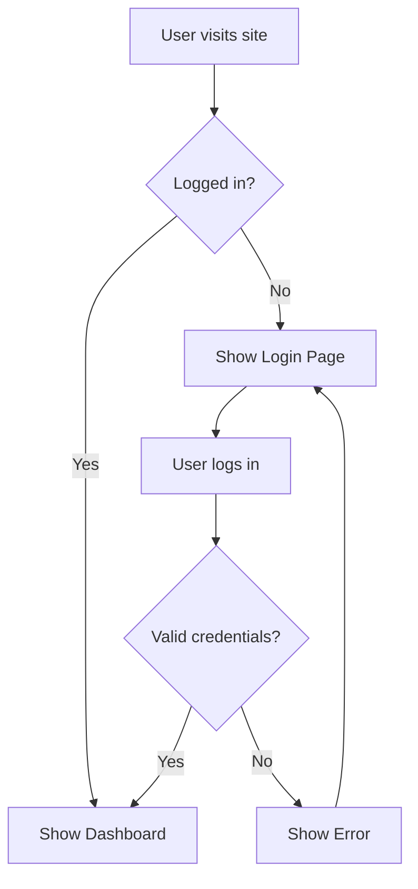
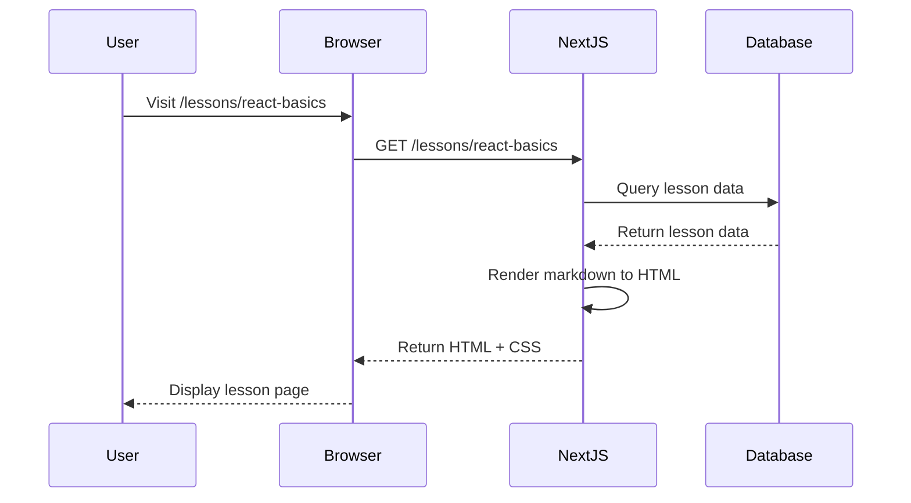
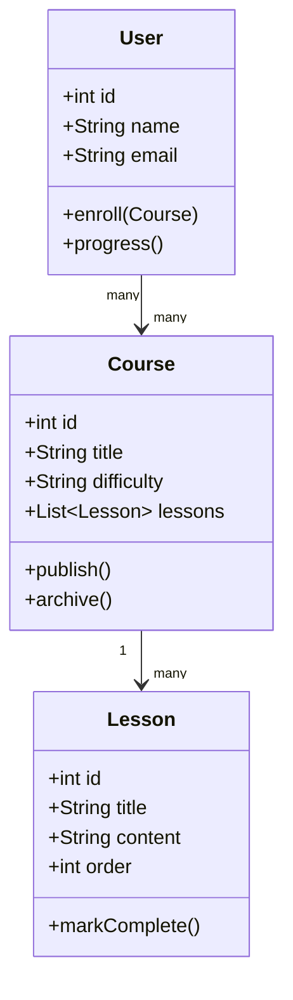
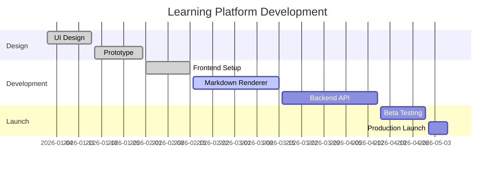
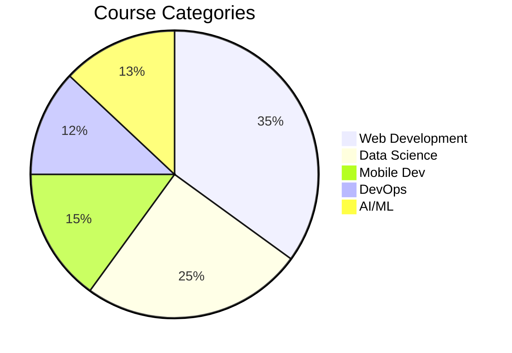
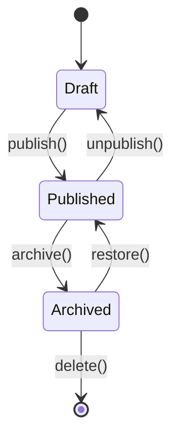
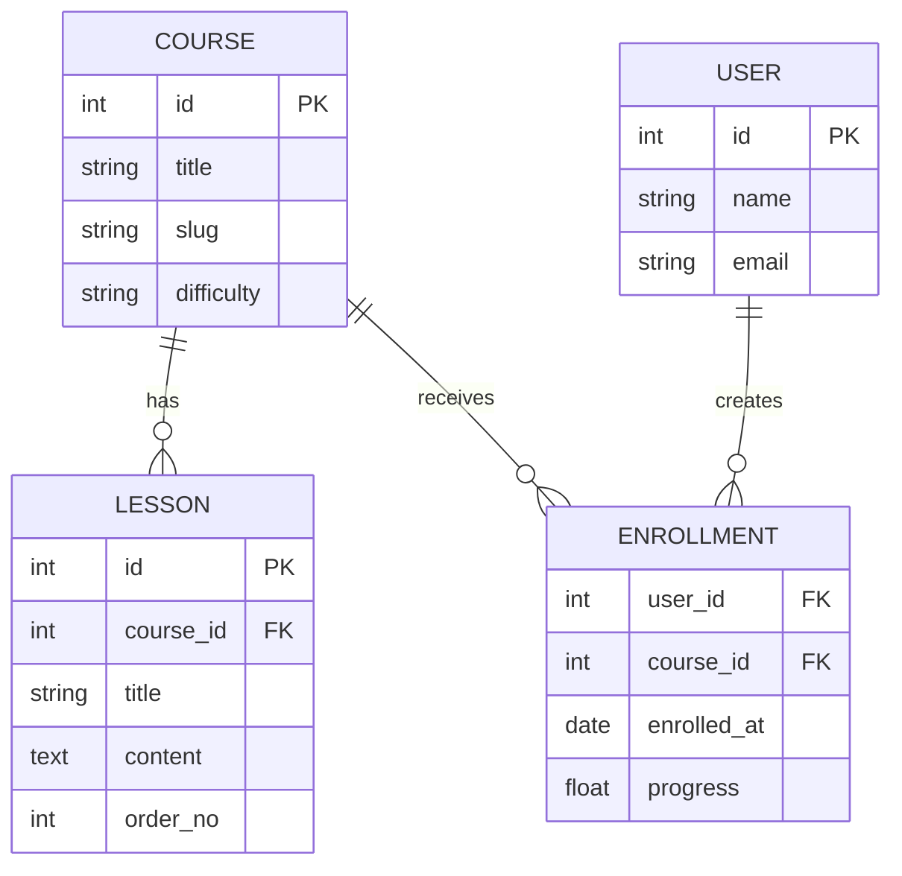

<!-- ============================================================
     COMPLETE MARKDOWN FEATURE REFERENCE
     Ek bhi feature skip nahi kiya — sab kuch yahan hai
     ============================================================ -->

# 1. HEADINGS — H1 se H6 tak

# H1 — Main Title (Sirf ek baar use hota hai per page)
## H2 — Section Heading
### H3 — Sub-Section Heading
#### H4 — Sub-Sub Heading
##### H5 — Small Heading
###### H6 — Smallest Heading

---

# 2. PARAGRAPHS & LINE BREAKS

Yeh ek normal paragraph hai. Markdown mein paragraph ek blank line se alag hote hain. Bahut saari cheezein ek hi paragraph mein likh sakte hain bina kisi problem ke.

Yeh dusra paragraph hai. Inke beech ek blank line hoti hai.

Agar aapko ek line break chahiye paragraph ke andar bina nayi paragraph banaye,  
toh line ke end mein do spaces daalte hain phir Enter karte hain.  
Dekho yeh alag line pe hai lekin same paragraph mein.

---

# 3. TEXT FORMATTING — Bold, Italic, Strikethrough, etc.

**Yeh bold text hai** — double asterisk se  
__Yeh bhi bold hai__ — double underscore se  

*Yeh italic text hai* — single asterisk se  
_Yeh bhi italic hai_ — single underscore se  

***Yeh bold aur italic dono hai*** — triple asterisk se  
___Yeh bhi bold italic hai___ — triple underscore se  
**_Yeh bhi bold italic hai_** — mix karke bhi hota hai  

~~Yeh strikethrough text hai~~ — double tilde se  

`Yeh inline code hai` — backtick se  

==Yeh highlighted text hai== — double equals se (extended markdown)  

~Yeh subscript hai~ — single tilde (some parsers)  
^Yeh superscript hai^ — caret (some parsers)  

<mark>HTML mark tag se highlight</mark>  
<sub>HTML subscript</sub>  
<sup>HTML superscript</sup>  
<ins>Underline / Inserted text</ins>  
<del>Deleted text via HTML</del>  
<small>Chota text HTML se</small>  
<kbd>Ctrl</kbd> + <kbd>C</kbd> — Keyboard key styling  
<abbr title="HyperText Markup Language">HTML</abbr> — Abbreviation  

---

# 4. BLOCKQUOTES

> Yeh ek simple blockquote hai.

> Yeh ek multi-line blockquote hai.  
> Dono lines same quote mein hain.  
> Teen lines bhi ho sakti hain.

> **Bold text** blockquote ke andar.
> 
> Yeh dusra paragraph hai same blockquote mein.

> ### Heading bhi blockquote mein aa sakti hai
> - List item bhi aa sakti hai
> - Dusra list item

> Outer blockquote
>
> > Nested blockquote (andar wala)
> >
> > > Triple nested blockquote

> **Note:** Yeh ek note-style blockquote hai jo learning platforms pe common hai.

> **Warning:** Yeh warning style ke liye hai.

> **Tip:** Helpful tip ke liye yeh style use hota hai.

> **Info:** Information ke liye.

> **Danger:** Dangerous operation ke liye.

---

# 5. LISTS

## 5a. Unordered List (Bullet List)

- Pehla item
- Dusra item
- Teesra item

* Asterisk se bhi bullet banta hai
* Dusra item asterisk se
* Teesra item

+ Plus sign se bhi bullet banta hai
+ Dusra item plus se

## 5b. Ordered List (Numbered List)

1. Pehla step
2. Dusra step
3. Teesra step

1. Markdown ordered list mein
1. Sab ko 1 likhne par bhi
1. Auto-increment hota hai render mein

## 5c. Nested Lists (Multi-level)

- Pehla level item
  - Dusra level item (2 spaces ya tab)
    - Teesra level item
      - Chautha level item
        - Paanchva level item
  - Wapas dusre level pe
- Wapas pehle level pe

1. Pehla ordered item
   1. Nested ordered
   2. Dusra nested ordered
      1. Triple nested
      2. Triple nested dusra
   3. Wapas dusre level pe
2. Dusra main item

## 5d. Mixed Lists (Ordered + Unordered)

1. Pehla ordered item
   - Unordered sub-item
   - Dusra unordered sub-item
     1. Wapas ordered
     2. Dusra ordered
2. Dusra ordered item
   - Sub bullet

## 5e. Task List / Checklist (GitHub Flavored Markdown)

- [x] Completed task — yeh poora ho gaya
- [x] Yeh bhi done hai
- [ ] Yeh abhi pending hai
- [ ] Yeh bhi pending
- [x] Phir ek complete task
  - [x] Nested completed sub-task
  - [ ] Nested incomplete sub-task
- [ ] Last pending item

---

# 6. CODE

## 6a. Inline Code

`console.log("Hello World")` — inline code backtick se

`npm install next react react-dom` — command

`const x = 42;` — variable

HTML tag mein: use `<div>` wrapper element

## 6b. Fenced Code Block — Bina Language

```
Yeh plain code block hai
Koi syntax highlighting nahi
Sirf monospace font mein dikhta hai
```

## 6c. Code Block — JavaScript

```javascript
// JavaScript code block
const greet = (name) => {
  return `Hello, ${name}!`;
};

console.log(greet("World"));

// Async function example
async function fetchData(url) {
  try {
    const response = await fetch(url);
    const data = await response.json();
    return data;
  } catch (error) {
    console.error("Error:", error);
  }
}
```

## 6d. Code Block — TypeScript

```typescript
// TypeScript example
interface User {
  id: number;
  name: string;
  email: string;
  role: "admin" | "user" | "guest";
}

type ApiResponse<T> = {
  data: T;
  status: number;
  message: string;
};

const getUser = async (id: number): Promise<ApiResponse<User>> => {
  const response = await fetch(`/api/users/${id}`);
  return response.json();
};
```

## 6e. Code Block — React / JSX

```jsx
// React Component
import { useState, useEffect } from "react";

function LearningCard({ title, description, difficulty }) {
  const [isExpanded, setIsExpanded] = useState(false);

  useEffect(() => {
    document.title = title;
  }, [title]);

  return (
    <div className="card">
      <h2>{title}</h2>
      <span className={`badge badge-${difficulty}`}>{difficulty}</span>
      {isExpanded && <p>{description}</p>}
      <button onClick={() => setIsExpanded(!isExpanded)}>
        {isExpanded ? "Collapse" : "Expand"}
      </button>
    </div>
  );
}

export default LearningCard;
```

## 6f. Code Block — Next.js

```jsx
// Next.js App Router — page.jsx
import { Suspense } from "react";
import { notFound } from "next/navigation";

export async function generateMetadata({ params }) {
  return {
    title: `Lesson: ${params.slug}`,
    description: "Learning platform lesson page",
  };
}

async function getLessonData(slug) {
  const res = await fetch(`/api/lessons/${slug}`, {
    next: { revalidate: 3600 },
  });
  if (!res.ok) notFound();
  return res.json();
}

export default async function LessonPage({ params }) {
  const lesson = await getLessonData(params.slug);

  return (
    <Suspense fallback={<div>Loading...</div>}>
      <article>
        <h1>{lesson.title}</h1>
        <div dangerouslySetInnerHTML={{ __html: lesson.content }} />
      </article>
    </Suspense>
  );
}
```

## 6g. Code Block — Python

```python
# Python example
from typing import Optional, List
from dataclasses import dataclass

@dataclass
class Course:
    id: int
    title: str
    topics: List[str]
    difficulty: str = "beginner"
    rating: Optional[float] = None

def filter_courses(
    courses: List[Course],
    difficulty: str,
    min_rating: float = 0.0
) -> List[Course]:
    """Filter courses by difficulty and minimum rating."""
    return [
        c for c in courses
        if c.difficulty == difficulty
        and (c.rating or 0) >= min_rating
    ]

courses = [
    Course(1, "Python Basics", ["variables", "loops"], "beginner", 4.5),
    Course(2, "Advanced Python", ["decorators", "async"], "advanced", 4.8),
]

beginners = filter_courses(courses, "beginner", min_rating=4.0)
print(beginners)
```

## 6h. Code Block — CSS

```css
/* CSS Example */
:root {
  --primary: #6366f1;
  --secondary: #8b5cf6;
  --bg: #0f0f0f;
  --text: #f1f1f1;
  --radius: 12px;
}

.card {
  background: var(--bg);
  color: var(--text);
  border-radius: var(--radius);
  padding: 1.5rem;
  box-shadow: 0 4px 24px rgba(0, 0, 0, 0.3);
  transition: transform 0.2s ease, box-shadow 0.2s ease;
}

.card:hover {
  transform: translateY(-4px);
  box-shadow: 0 8px 32px rgba(99, 102, 241, 0.3);
}

@media (max-width: 768px) {
  .card {
    padding: 1rem;
    border-radius: 8px;
  }
}
```

## 6i. Code Block — Bash / Shell

```bash
# Shell commands
# Next.js project setup
npx create-next-app@latest my-learning-platform \
  --typescript \
  --tailwind \
  --eslint \
  --app

cd my-learning-platform

# Install markdown libraries
npm install gray-matter remark remark-html
npm install @next/mdx @mdx-js/loader @mdx-js/react

# Environment variables
cp .env.example .env.local
echo "DATABASE_URL=postgresql://..." >> .env.local

# Run dev server
npm run dev
```

## 6j. Code Block — JSON

```json
{
  "name": "my-learning-platform",
  "version": "1.0.0",
  "scripts": {
    "dev": "next dev",
    "build": "next build",
    "start": "next start",
    "lint": "next lint"
  },
  "dependencies": {
    "next": "^15.0.0",
    "react": "^18.3.0",
    "react-dom": "^18.3.0",
    "gray-matter": "^4.0.3",
    "remark": "^15.0.0",
    "remark-html": "^16.0.0"
  },
  "config": {
    "features": {
      "darkMode": true,
      "search": true,
      "comments": false
    }
  }
}
```

## 6k. Code Block — YAML

```yaml
# YAML configuration
site:
  title: "My Learning Platform"
  description: "Learn everything in one place"
  url: "https://myplatform.com"
  lang: "en"

features:
  dark_mode: true
  search: true
  progress_tracking: true
  certificates: false

courses:
  - id: 1
    title: "React Fundamentals"
    difficulty: beginner
    topics:
      - Components
      - Props
      - State
      - Hooks
  - id: 2
    title: "Next.js Advanced"
    difficulty: advanced
    topics:
      - App Router
      - Server Components
      - Streaming
```

## 6l. Code Block — SQL

```sql
-- SQL Example
CREATE TABLE courses (
  id         SERIAL PRIMARY KEY,
  title      VARCHAR(255) NOT NULL,
  slug       VARCHAR(255) UNIQUE NOT NULL,
  difficulty VARCHAR(50) DEFAULT 'beginner',
  created_at TIMESTAMP DEFAULT NOW()
);

CREATE TABLE lessons (
  id         SERIAL PRIMARY KEY,
  course_id  INTEGER REFERENCES courses(id) ON DELETE CASCADE,
  title      VARCHAR(255) NOT NULL,
  content    TEXT,
  order_no   INTEGER NOT NULL,
  created_at TIMESTAMP DEFAULT NOW()
);

-- Query: All courses with lesson count
SELECT
  c.title,
  c.difficulty,
  COUNT(l.id) AS lesson_count
FROM courses c
LEFT JOIN lessons l ON l.course_id = c.id
GROUP BY c.id
ORDER BY c.created_at DESC;
```

## 6m. Code Block — Diff (Changes)

```diff
- const oldFunction = () => {
-   return "old result";
- }

+ const newFunction = () => {
+   return "new result";
+ }

  // This line stayed the same
  export default newFunction;
```

## 6n. Code Block — Markdown (meta!)

```markdown
# Heading in code block

**Bold** and *italic*

- List item
- Another item

[Link](https://example.com)
```

---

# 7. HORIZONTAL RULES (Dividers)

Teeno tarike kaam karte hain:

---

Hyphen se (3 ya zyada):

***

Asterisk se (3 ya zyada):

___

Underscore se (3 ya zyada):

---

# 8. LINKS

## 8a. Inline Links

[Yeh ek basic link hai](https://www.google.com)

[Link with title on hover](https://www.google.com "Google ka homepage")

[Relative link apne hi site ka](/about)

[Relative link with hash](#headings)

## 8b. Reference Links

[Yeh ek reference link hai][google-ref]

[Dusra reference link][nextjs-docs]

[Title ke saath reference][react-ref]

<!-- References define karo file ke end mein ya kahin bhi -->
[google-ref]: https://www.google.com
[nextjs-docs]: https://nextjs.org/docs
[react-ref]: https://react.dev "React Official Docs"

## 8c. Auto Links

<https://www.example.com>

<email@example.com>

## 8d. Link with Emphasis

**[Bold link](https://example.com)**

*[Italic link](https://example.com)*

[`Code link`](https://example.com)

---

# 9. IMAGES

## 9a. Inline Image


## 9b. Image with Title


## 9c. Reference Image

![Reference style image][hero-image]

[hero-image]: https://via.placeholder.com/800x400/22c55e/ffffff?text=Hero+Image

## 9d. Image as a Link (Clickable Image)

[](https://example.com)

## 9e. Image with HTML (for size control)


---

# 10. TABLES

## 10a. Basic Table

| Column 1 | Column 2 | Column 3 |
|----------|----------|----------|
| Cell 1   | Cell 2   | Cell 3   |
| Cell 4   | Cell 5   | Cell 6   |
| Cell 7   | Cell 8   | Cell 9   |

## 10b. Table with Alignment

| Left Aligned | Center Aligned | Right Aligned |
|:-------------|:--------------:|--------------:|
| Left         | Center         | Right         |
| Text         | Text           | Text          |
| More text    | More center    | More right    |

## 10c. Table with Formatting Inside

| Feature       | Status     | Notes                        |
|---------------|------------|------------------------------|
| **Headings**  | ✅ Done    | H1 se H6 tak sab             |
| *Italic*      | ✅ Done    | Single asterisk ya underscore |
| `Code`        | ✅ Done    | Backtick se inline code      |
| ~~Strike~~    | ✅ Done    | Double tilde se              |
| [Links](#)    | ✅ Done    | Inline aur reference dono    |
| Tables        | ✅ Done    | Yahi wala!                   |
| Task Lists    | ✅ Done    | Checkbox wala                |

## 10d. Large Data Table

| Rank | Language   | Paradigm     | Year | Creator        | Use Case          |
|-----:|:-----------|:-------------|:----:|:---------------|:------------------|
| 1    | JavaScript | Multi        | 1995 | Brendan Eich   | Web Frontend/Back |
| 2    | Python     | Multi        | 1991 | Guido van Rossum| AI, Data, Scripts |
| 3    | TypeScript | OOP + FP     | 2012 | Microsoft      | Typed JS          |
| 4    | Rust       | Systems      | 2010 | Mozilla        | Systems, WASM     |
| 5    | Go         | Procedural   | 2009 | Google         | Backend, DevOps   |

---

# 11. FOOTNOTES

Yeh ek text hai jisme footnote hai.[^1]

Dusra sentence jisme doosra footnote hai.[^note]

Lamba footnote bhi ho sakta hai.[^long-note]

[^1]: Yeh pehla footnote ka content hai.
[^note]: Yeh dusra footnote hai — koi bhi label de sakte hain.
[^long-note]: Yeh ek lamba footnote hai.

    Iske andar paragraph bhi ho sakta hai.

    Aur aur content bhi.

---

# 12. DEFINITION LISTS (Extended Markdown)

Markdown
:   Ek lightweight markup language hai jo plain text ko formatted text mein convert karta hai.

HTML
:   HyperText Markup Language — web pages banane ki primary language.

Next.js
:   React-based framework jo server-side rendering aur static site generation support karta hai.
:   Vercel ne banaya hai.

---

# 13. MATH / LATEX (KaTeX / MathJax)

## 13a. Inline Math

Einstein ka famous equation: $E = mc^2$

Pythagorean theorem: $a^2 + b^2 = c^2$

Quadratic formula: $x = \frac{-b \pm \sqrt{b^2 - 4ac}}{2a}$

## 13b. Block / Display Math

$$
\int_{-\infty}^{\infty} e^{-x^2} dx = \sqrt{\pi}
$$

$$
\frac{\partial f}{\partial x} = \lim_{h \to 0} \frac{f(x+h) - f(x)}{h}
$$

$$
\sum_{n=1}^{\infty} \frac{1}{n^2} = \frac{\pi^2}{6}
$$

$$
\begin{pmatrix}
a & b \\
c & d
\end{pmatrix}
\begin{pmatrix}
x \\
y
\end{pmatrix}
=
\begin{pmatrix}
ax + by \\
cx + dy
\end{pmatrix}
$$

---

# 14. MERMAID DIAGRAMS

## 14a. Flowchart



## 14b. Sequence Diagram



## 14c. Class Diagram



## 14d. Gantt Chart



## 14e. Pie Chart



## 14f. State Diagram



## 14g. Entity Relationship Diagram



---

# 15. ADMONITIONS / CALLOUTS (Extended)

> [!NOTE]
> Yeh **Note** callout hai — extra information ke liye.

> [!TIP]
> Yeh **Tip** callout hai — helpful suggestions ke liye.

> [!IMPORTANT]
> Yeh **Important** callout hai — zaruri information ke liye.

> [!WARNING]
> Yeh **Warning** callout hai — caution ke liye.

> [!CAUTION]
> Yeh **Caution** callout hai — negative consequences ke liye.

<!-- Alternative admonition style for platforms like Docusaurus/Obsidian -->

:::note
Yeh Docusaurus-style note admonition hai.
:::

:::tip Pro Tip
React mein `useMemo` aur `useCallback` tab use karo jab genuinely performance issue ho.
:::

:::warning
Production mein `console.log` mat chhodna!
:::

:::danger Critical
`DROP TABLE` command kabhi bina backup ke mat chalana!
:::

:::info
Next.js 15 mein App Router default ho gaya hai.
:::

---

# 16. DETAILS / SUMMARY — Collapsible Sections

<details>
<summary>Click karke expand karo — Basic Example</summary>

Yeh andar ki content hai jo collapse hoti hai by default.

Isme **bold**, *italic*, aur `code` sab kuch aa sakta hai.

- List items bhi
- Koi bhi markdown

</details>

<details>
<summary>📚 Course Syllabus — Click to expand</summary>

## Module 1: Foundations
- HTML Basics
- CSS Fundamentals
- JavaScript Core

## Module 2: React
- Components & Props
- State Management
- Custom Hooks

## Module 3: Next.js
- File-based Routing
- Server Components
- API Routes
- Deployment

</details>

<details open>
<summary>✅ Yeh by default open hai (`open` attribute se)</summary>

Is section mein content visible hai page load pe.

```javascript
// Yeh andar code block bhi aa sakta hai
const message = "Details tag ke andar!";
console.log(message);
```

</details>

---

# 17. HTML EMBEDS (Markdown ke andar HTML)

## 17a. Colored Text (HTML se)

<span style="color: #6366f1;">Indigo colored text</span>  
<span style="color: #22c55e;">Green colored text</span>  
<span style="color: #ef4444;">Red colored text</span>  
<span style="background-color: #fef08a; color: #000;">Highlighted with background</span>

## 17b. Center Aligned Content

<div align="center">

**Yeh centered content hai**

Paragraph bhi center ho sakta hai.

</div>

## 17c. HTML Table (Rich Table)

<table>
  <thead>
    <tr>
      <th>Feature</th>
      <th>Basic MD</th>
      <th>Extended MD</th>
      <th>HTML in MD</th>
    </tr>
  </thead>
  <tbody>
    <tr>
      <td><strong>Tables</strong></td>
      <td>✅</td>
      <td>✅</td>
      <td>✅</td>
    </tr>
    <tr>
      <td><strong>Colspan</strong></td>
      <td>❌</td>
      <td>❌</td>
      <td>✅</td>
    </tr>
    <tr>
      <td><strong>Rowspan</strong></td>
      <td>❌</td>
      <td>❌</td>
      <td>✅</td>
    </tr>
  </tbody>
</table>

## 17d. Iframe Embed

<iframe
  width="560"
  height="315"
  src="https://www.youtube.com/embed/dQw4w9WgXcQ"
  title="YouTube video"
  frameborder="0"
  allowfullscreen>
</iframe>

## 17e. Audio Embed

<audio controls>
  <source src="/audio/lesson-intro.mp3" type="audio/mpeg">
  Aapka browser audio support nahi karta.
</audio>

## 17f. Video Embed

<video width="640" height="360" controls poster="/thumbnail.jpg">
  <source src="/video/lesson.mp4" type="video/mp4">
  <source src="/video/lesson.webm" type="video/webm">
  Aapka browser video support nahi karta.
</video>

---

# 18. ESCAPE CHARACTERS

Backslash se special characters escape ho jaate hain:

\*Yeh italic nahi banega\*  
\*\*Yeh bold nahi banega\*\*  
\# Yeh heading nahi banega  
\[Yeh link nahi banega\]  
\`Yeh code nahi banega\`  
\> Yeh blockquote nahi banega  
\- Yeh list nahi banega  
\| Yeh table nahi banega  
\\ Yeh backslash hai  
\. Yeh period hai  
\! Yeh exclamation hai  

---

# 19. EMOJIS

## 19a. Direct Unicode Emojis

🎯 Target  🚀 Rocket  💡 Idea  ✅ Check  ❌ Cross  
📚 Books  🔥 Fire  ⭐ Star  💎 Diamond  🏆 Trophy  
🎓 Graduate  👨‍💻 Developer  🌐 Globe  📱 Mobile  💻 Laptop  
⚡ Lightning  🔑 Key  🛡️ Shield  🔧 Tool  📊 Chart  

## 19b. Emoji in Context

> 💡 **Tip:** Emojis se content visually appealing banta hai

- ✅ Completed lessons
- 🔄 In progress  
- 🔒 Locked content
- 🌟 Featured course

---

# 20. FRONT MATTER VARIABLES REFERENCE

Upar YAML front matter mein jo fields hain, unka reference:

| Field          | Type     | Example                    | Use Case               |
|:---------------|:---------|:---------------------------|:-----------------------|
| `title`        | String   | "My Lesson Title"          | Page title, SEO        |
| `description`  | String   | "Short description"        | Meta description       |
| `date`         | Date     | "2026-04-16"               | Publication date       |
| `author`       | String   | "John Doe"                 | Author name            |
| `tags`         | Array    | ["react", "nextjs"]        | Filtering/search       |
| `category`     | String   | "Web Development"          | Category grouping      |
| `cover_image`  | String   | "https://..."              | Hero image URL         |
| `reading_time` | String   | "10 min"                   | Estimated read time    |
| `difficulty`   | String   | "beginner/inter/advanced"  | Skill level badge      |
| `draft`        | Boolean  | true/false                 | Hide/show in prod      |
| `slug`         | String   | "react-hooks-guide"        | URL path               |
| `series`       | String   | "React Series"             | Lesson grouping        |
| `order`        | Number   | 1, 2, 3                    | Series order           |
| `prerequisites`| Array    | ["javascript-basics"]      | Required prev lessons  |
| `updated_at`   | Date     | "2026-04-16"               | Last updated date      |

---

# 21. SPECIAL CHARACTERS & SYMBOLS

## 21a. Typography

En dash: -- (some parsers convert) → –  
Em dash: --- → —  
Ellipsis: ... → …  
Quotes: "double" 'single'  
Copyright: &copy; © Trademark: &trade; ™ Registered: &reg; ®  
Degree: &deg; 45°  
Plus-minus: &plusmn; ±  
Multiplication: &times; ×  
Division: &divide; ÷  
Infinity: &infin; ∞  
Pi: &pi; π  
Alpha: &alpha; α Beta: &beta; β  
Arrow right: &rarr; → Arrow left: &larr; ←  
Double arrow: &harr; ↔  
Up arrow: &uarr; ↑ Down arrow: &darr; ↓  

## 21b. HTML Entities

| Entity Code  | Symbol | Name           |
|:-------------|:------:|:---------------|
| `&amp;`      | &amp;  | Ampersand      |
| `&lt;`       | &lt;   | Less than      |
| `&gt;`       | &gt;   | Greater than   |
| `&quot;`     | &quot; | Double quote   |
| `&apos;`     | &apos; | Apostrophe     |
| `&nbsp;`     | &nbsp; | Non-break space|
| `&mdash;`    | &mdash;| Em dash        |
| `&ndash;`    | &ndash;| En dash        |
| `&hellip;`   | &hellip;| Ellipsis      |
| `&copy;`     | &copy; | Copyright      |

---

# 22. COMMENTS (Invisible in Rendered Output)

<!-- Yeh ek HTML comment hai — render mein nahi dikhega -->

<!-- 
  Multi-line comment bhi ho sakta hai
  Yeh sab lines invisible rahenge
  Useful for TODO notes ya disabled content
-->

<!-- TODO: Add more examples here -->
<!-- FIXME: Fix the broken link below -->
<!-- NOTE: Yeh section draft hai -->

---

# 23. LINE BREAKS & WHITESPACE CONTROL

Paragraph 1 — normal gap ke saath alag.

Paragraph 2 — blank line se separate.

Forced line break (do trailing spaces):  
Yeh nyi line hai same paragraph mein.  
Teesri line bhi same paragraph.

`<br>` HTML tag se bhi:
Line 1<br>
Line 2<br>
Line 3

---

# 24. ABBREVIATIONS (Extended Markdown)

*[HTML]: HyperText Markup Language
*[CSS]: Cascading Style Sheets
*[JS]: JavaScript
*[API]: Application Programming Interface
*[MD]: Markdown
*[SSR]: Server-Side Rendering
*[SSG]: Static Site Generation
*[ISR]: Incremental Static Regeneration

Agar parser support karta hai, toh HTML, CSS, JS, API — in shabdon ke neeche dotted underline aata hai jab hover karo.

---

# 25. CUSTOM ID / ANCHOR (Heading ke saath)

## My Section {#custom-anchor-id}

### Another Section {#another-id}

Ab link kar sakte ho:
[Custom anchor pe jaao](#custom-anchor-id)

---

# 26. SUPERSCRIPT & SUBSCRIPT (Multiple Ways)

## Using HTML tags:
H<sub>2</sub>O — water  
CO<sub>2</sub> — carbon dioxide  
x<sup>2</sup> + y<sup>2</sup> = z<sup>2</sup>  
E = mc<sup>2</sup>  
2<sup>10</sup> = 1024  
Footnote style<sup>[1]</sup>  

## Using Extended Markdown (some parsers):
~subscript~ format  
^superscript^ format  

---

# 27. BADGE / SHIELD IMAGES


---

# 28. PROGRESS INDICATORS (HTML in MD)

Course progress:

<progress value="75" max="100">75%</progress>

**JavaScript:** <progress value="90" max="100"></progress> 90%  
**TypeScript:** <progress value="70" max="100"></progress> 70%  
**React:**      <progress value="85" max="100"></progress> 85%  
**Next.js:**    <progress value="60" max="100"></progress> 60%  

---

# 29. KEYBOARD SHORTCUTS REFERENCE

| Action              | Windows/Linux           | Mac                     |
|:--------------------|:------------------------|:------------------------|
| Bold                | <kbd>Ctrl</kbd>+<kbd>B</kbd> | <kbd>⌘</kbd>+<kbd>B</kbd> |
| Italic              | <kbd>Ctrl</kbd>+<kbd>I</kbd> | <kbd>⌘</kbd>+<kbd>I</kbd> |
| Save                | <kbd>Ctrl</kbd>+<kbd>S</kbd> | <kbd>⌘</kbd>+<kbd>S</kbd> |
| Copy                | <kbd>Ctrl</kbd>+<kbd>C</kbd> | <kbd>⌘</kbd>+<kbd>C</kbd> |
| Paste               | <kbd>Ctrl</kbd>+<kbd>V</kbd> | <kbd>⌘</kbd>+<kbd>V</kbd> |
| Undo                | <kbd>Ctrl</kbd>+<kbd>Z</kbd> | <kbd>⌘</kbd>+<kbd>Z</kbd> |
| Find                | <kbd>Ctrl</kbd>+<kbd>F</kbd> | <kbd>⌘</kbd>+<kbd>F</kbd> |

---

# 30. MULTI-LANGUAGE CODE TABS (MDX Style)

Yeh normal markdown mein multiple code blocks hote hain — MDX ya custom components se tab UI ban sakti hai:

**JavaScript version:**
```javascript
async function getData() {
  const res = await fetch('/api/data');
  return res.json();
}
```

**TypeScript version:**
```typescript
async function getData(): Promise<Record<string, unknown>> {
  const res = await fetch('/api/data');
  return res.json() as Promise<Record<string, unknown>>;
}
```

**Python version:**
```python
import requests

def get_data():
    response = requests.get('/api/data')
    return response.json()
```

---

# 31. ORDERED LIST — CUSTOM START

Starting from 5:

5. Paanchva item
6. Chhatha item
7. Saatva item

---

# 32. NESTED BLOCKQUOTE WITH CODE

> **Important concept:**
>
> Jab async function use karo:
>
> ```javascript
> async function example() {
>   const result = await someOperation();
>   return result;
> }
> ```
>
> Hamesha `await` keyword use karo async function ke andar.

---

# 33. COMPLETE FRONT MATTER EXAMPLE (Extended)

```yaml
---
# Basic Info
title: "React Hooks Complete Guide"
slug: "react-hooks-complete-guide"
description: "useState se useReducer tak — har hook ka deep dive"
excerpt: "React hooks ke baare mein sab kuch ek jagah"

# Authoring
author:
  name: "Your Name"
  email: "you@example.com"
  avatar: "/authors/you.jpg"
  bio: "Full-stack developer"
date: "2026-04-16"
updated_at: "2026-04-16"
draft: false

# Classification
category: "React"
subcategory: "Hooks"
tags: ["react", "hooks", "javascript", "frontend"]
series: "React Masterclass"
series_order: 3

# Media
cover_image: "https://example.com/cover.jpg"
cover_image_alt: "React Hooks illustration"
og_image: "https://example.com/og.jpg"

# Learning Metadata
difficulty: "intermediate"
reading_time: "15 min"
prerequisites:
  - "javascript-basics"
  - "react-fundamentals"
next_lesson: "react-context-api"
prev_lesson: "react-state-management"

# SEO
seo_title: "React Hooks Complete Guide 2026"
seo_description: "Complete guide to React hooks"
canonical_url: "https://example.com/lessons/react-hooks"
no_index: false

# Features
enable_comments: true
enable_toc: true
enable_progress: true
featured: true
---
```

---

# 34. TABLE OF CONTENTS (Manual)

## Table of Contents

1. [Headings](#1-headings--h1-se-h6-tak)
2. [Paragraphs & Line Breaks](#2-paragraphs--line-breaks)
3. [Text Formatting](#3-text-formatting--bold-italic-strikethrough-etc)
4. [Blockquotes](#4-blockquotes)
5. [Lists](#5-lists)
6. [Code](#6-code)
7. [Horizontal Rules](#7-horizontal-rules-dividers)
8. [Links](#8-links)
9. [Images](#9-images)
10. [Tables](#10-tables)
11. [Footnotes](#11-footnotes)
12. [Definition Lists](#12-definition-lists-extended-markdown)
13. [Math / LaTeX](#13-math--latex-katex--mathjax)
14. [Mermaid Diagrams](#14-mermaid-diagrams)
15. [Admonitions](#15-admonitions--callouts-extended)
16. [Details / Summary](#16-details--summary--collapsible-sections)
17. [HTML Embeds](#17-html-embeds-markdown-ke-andar-html)
18. [Escape Characters](#18-escape-characters)
19. [Emojis](#19-emojis)
20. [Front Matter Variables](#20-front-matter-variables-reference)

---

# 35. COMBINED COMPLEX EXAMPLE

> ### 🚀 Quick Start Guide
>
> Neeche diye steps follow karo:
>
> 1. **Install** karo:
>    ```bash
>    npm install my-package
>    ```
> 2. **Configure** karo `config.js`:
>    ```javascript
>    module.exports = { debug: false };
>    ```
> 3. **Run** karo:
>    ```bash
>    npm start
>    ```
>
> ⚠️ **Note:** Node.js v18+ required hai. Check karo: `node --version`

---

# 36. GRID / COLUMNS (HTML in MD)

<div style="display: grid; grid-template-columns: 1fr 1fr; gap: 1rem;">

<div>

### Left Column
- Item 1
- Item 2
- Item 3

</div>

<div>

### Right Column
- Item A
- Item B
- Item C

</div>

</div>

---

<!-- ============================================================
     END OF COMPLETE MARKDOWN REFERENCE
     Har ek feature cover kiya gaya hai — ek bhi skip nahi!
     ============================================================ -->

---

*Last updated: April 16, 2026 | Version 1.0.0 | Complete Reference*
