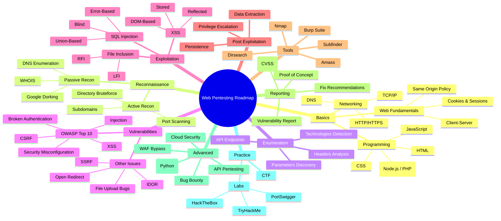

```mermaid
mindmap
  root((Web Pentesting Roadmap))
    Basics
      Networking
        TCP/IP
        DNS
        HTTP/HTTPS
      Web Fundamentals
        Client-Server
        Cookies & Sessions
        Same Origin Policy
      Programming
        HTML
        CSS
        JavaScript
        Backend (Node.js / PHP)
    Reconnaissance
      Passive Recon
        Google Dorking
        WHOIS
        DNS Enumeration
      Active Recon
        Subdomains
        Port Scanning
        Directory Bruteforce
    Enumeration
      Technologies Detection
      Headers Analysis
      Parameters Discovery
      API Endpoints
    Vulnerabilities
      OWASP Top 10
        Injection
        Broken Authentication
        XSS
        CSRF
        Security Misconfiguration
      Other Issues
        IDOR
        SSRF
        File Upload Bugs
        Open Redirect
    Exploitation
      XSS
        Stored
        Reflected
        DOM-Based
      SQL Injection
        Error-Based
        Union-Based
        Blind
      File Inclusion
        LFI
        RFI
    Post Exploitation
      Privilege Escalation
      Data Extraction
      Persistence
    Tools
      Burp Suite
      Nmap
      Subfinder
      Amass
      Dirsearch
    Reporting
      Vulnerability Report
      Proof of Concept
      Severity (CVSS)
      Fix Recommendations
    Advanced
      WAF Bypass
      Automation (Python)
      API Pentesting
      Cloud Security
      Bug Bounty
    Practice
      Labs
        PortSwigger
        TryHackMe
        HackTheBox
      CTF
```